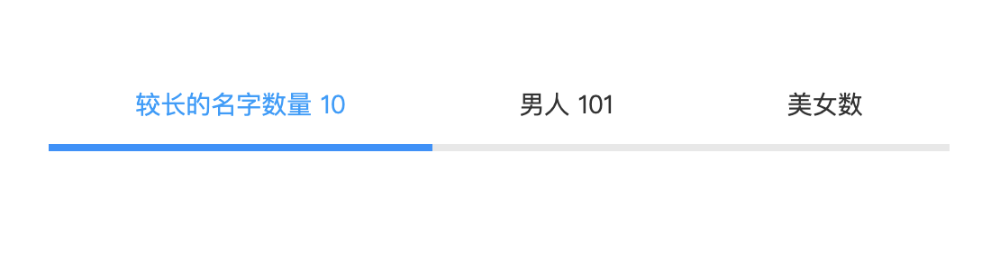

# 描述

开发一个 react 的 tabheader 组件。
风格和 ant-design 保持一致。由于开发中 UI 设计的 tab 风格，总是头和 body 是分开的，所以封装了一个单独 tabheader。

## 效果图



## 使用方式

```
import TabHeader from 'tabheader-react';

    <TabHeader
      defaultHead="abc"
      heardList={[
        { code: "abc", text: "较长的名字数量", num: "10" },
        { code: "abcd", text: "男人", num: "101" },
        { code: "abce1", text: "美女数", num: "0" },
      ]}
      onClickHeader={val => {
        alert(val);
      }}
    />
```

## 安装

```
npm i tabheader-react
```

## 查看 demo

[github 地址](https://github.com/codepandy/tabheader_react)

### 运行 demo

```
// clone 代码
git clone https://github.com/codepandy/tabheader_react

// 进入文件夹
cd tabheader_react

// 安装依赖
npm install

// 启动demo
npm run start
```
